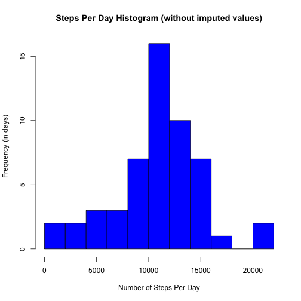
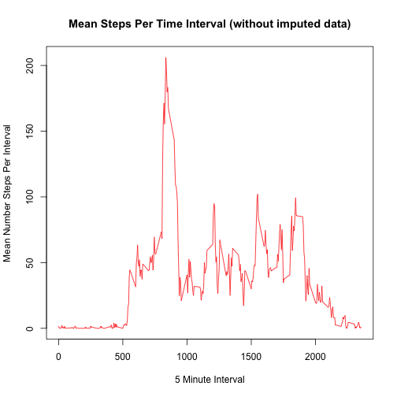
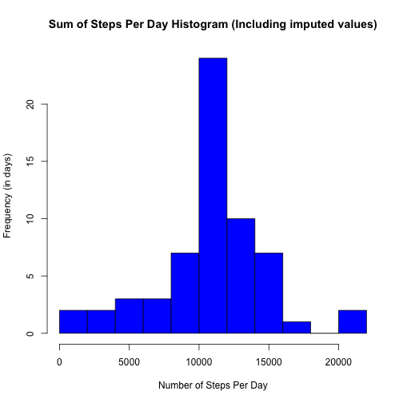
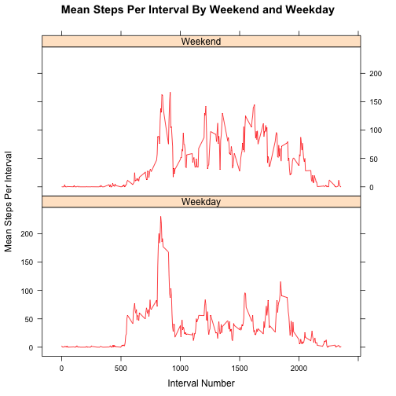

#
### Loading and preprocessing the data
#### Load the data (i.e. read.csv())


```r
dNoNAs <- subset(read.csv("activity.csv"), steps != 'NA')
```

#
### What is mean total number of steps taken per day?
#### Calculate the total number of steps taken per day.

```r
s <- data.frame(summarise(group_by(dNoNAs, date), SumStepsDay = sum(steps)))
s
```

```
##          date SumStepsDay
## 1  2012-10-02         126
## 2  2012-10-03       11352
## 3  2012-10-04       12116
## 4  2012-10-05       13294
## 5  2012-10-06       15420
## 6  2012-10-07       11015
## 7  2012-10-09       12811
## 8  2012-10-10        9900
## 9  2012-10-11       10304
## 10 2012-10-12       17382
## 11 2012-10-13       12426
## 12 2012-10-14       15098
## 13 2012-10-15       10139
## 14 2012-10-16       15084
## 15 2012-10-17       13452
## 16 2012-10-18       10056
## 17 2012-10-19       11829
## 18 2012-10-20       10395
## 19 2012-10-21        8821
## 20 2012-10-22       13460
## 21 2012-10-23        8918
## 22 2012-10-24        8355
## 23 2012-10-25        2492
## 24 2012-10-26        6778
## 25 2012-10-27       10119
## 26 2012-10-28       11458
## 27 2012-10-29        5018
## 28 2012-10-30        9819
## 29 2012-10-31       15414
## 30 2012-11-02       10600
## 31 2012-11-03       10571
## 32 2012-11-05       10439
## 33 2012-11-06        8334
## 34 2012-11-07       12883
## 35 2012-11-08        3219
## 36 2012-11-11       12608
## 37 2012-11-12       10765
## 38 2012-11-13        7336
## 39 2012-11-15          41
## 40 2012-11-16        5441
## 41 2012-11-17       14339
## 42 2012-11-18       15110
## 43 2012-11-19        8841
## 44 2012-11-20        4472
## 45 2012-11-21       12787
## 46 2012-11-22       20427
## 47 2012-11-23       21194
## 48 2012-11-24       14478
## 49 2012-11-25       11834
## 50 2012-11-26       11162
## 51 2012-11-27       13646
## 52 2012-11-28       10183
## 53 2012-11-29        7047
```

#
#### Make a histogram of the total number of steps taken each day.


```r
hist(s$SumStepsDay, 
     breaks = 10, 
     xlab = 'Number of Steps Per Day', 
     ylab = 'Frequency (in days)', 
     main = 'Steps Per Day Histogram (without imputed values)',
     col = c('blue'))
```

 

#
#### Calculate and report the mean and median of the total number of steps taken per day (without imputing values)


```r
a <- c('Number Days With Step Data', 'Mean Steps/Day', 'Median Steps/Day')
NumberOfDaysWithStepData = nrow(s)
MeanStepsPerDay = mean(s$SumStepsDay)
MedianStepsPerDay = median(s$SumStepsDay)
data.frame(NumberOfDaysWithStepData, MeanStepsPerDay, MedianStepsPerDay) 
```

```
##   NumberOfDaysWithStepData MeanStepsPerDay MedianStepsPerDay
## 1                       53        10766.19             10765
```

#
### What is the average daily activity pattern?
#### Make a time series plot (i.e. type = "l") of the 5-minute interval (x-axis) and the average number of steps taken, averaged across all days (y-axis).

```r
by5minNoNAs <- group_by(dNoNAs, interval)
by5minNoNAs <- data.frame(summarize(by5minNoNAs, MeanStepsInterval = mean(steps)))
plot(x = by5minNoNAs$interval, 
     y = by5minNoNAs$MeanStepsInterval, 
     type = 'l',
     xlab = '5 Minute Interval',
     ylab = 'Mean Number Steps Per Interval',
     main = 'Mean Steps Per Time Interval (without imputed data)',
     col = 2)
```

 

#
#### Which 5-minute interval, on average across all the days in the dataset, contains the maximum number of steps?

```r
by5minNoNAs[with(by5minNoNAs, order(-MeanStepsInterval)), ][1,]
```

```
##     interval MeanStepsInterval
## 104      835          206.1698
```

#
### Imputing missing values
#### Calculate and report the total number of missing values in the dataset (i.e. the total number of rows with NAs)


```r
## Load the original dataset again but include the NAs.
dWithNAs <- read.csv("activity.csv")

## Count and display the NA rows
cnt <- sum(is.na(dWithNAs$steps))
sprintf("The number of rows with NAs = %d", cnt)
```

```
## [1] "The number of rows with NAs = 2304"
```

#
#### (Devise a strategy for filling in all of the missing values in the dataset. The strategy does not need to be sophisticated. For example, you could use the mean/median for that day, or the mean for that 5-minute interval, etc.)

#### Create a new dataset that is equal to the original dataset but with the missing data filled in. Use the mean steps per interval as a strategy for imputing missing values.


```r
## Merge the dataframe containing NAs with the dataframe containing mean steps per 
## 5 minute interval. Do merge based on matching interval number.
dWithNAs <- merge(dWithNAs, by5minNoNAs, by.x = "interval", by.y = "interval")

## For every interval with NA in the steps column, replace the NA with value in the 
## MeanStepsInterval column in the merged dataframe.
dWithNAs = within(dWithNAs, { 
      steps = ifelse(is.na(steps), MeanStepsInterval, steps) 
    } )

## Sort the merged dataset by date (from being sorted by interval number).
dWithNAs <- dWithNAs[with(dWithNAs, order(date)), ]
```

#
#### Make a histogram of the total number of steps taken each day and calculate and report the mean and median total number of steps taken per day (including the imputed values). 


```r
## Calculate total steps per day including imputed values.
bydayWithNAs <- group_by(dWithNAs, date)
t <- data.frame(summarise(bydayWithNAs, SumStepsDay = sum(steps)))
t
```

```
##          date SumStepsDay
## 1  2012-10-01    10766.19
## 2  2012-10-02      126.00
## 3  2012-10-03    11352.00
## 4  2012-10-04    12116.00
## 5  2012-10-05    13294.00
## 6  2012-10-06    15420.00
## 7  2012-10-07    11015.00
## 8  2012-10-08    10766.19
## 9  2012-10-09    12811.00
## 10 2012-10-10     9900.00
## 11 2012-10-11    10304.00
## 12 2012-10-12    17382.00
## 13 2012-10-13    12426.00
## 14 2012-10-14    15098.00
## 15 2012-10-15    10139.00
## 16 2012-10-16    15084.00
## 17 2012-10-17    13452.00
## 18 2012-10-18    10056.00
## 19 2012-10-19    11829.00
## 20 2012-10-20    10395.00
## 21 2012-10-21     8821.00
## 22 2012-10-22    13460.00
## 23 2012-10-23     8918.00
## 24 2012-10-24     8355.00
## 25 2012-10-25     2492.00
## 26 2012-10-26     6778.00
## 27 2012-10-27    10119.00
## 28 2012-10-28    11458.00
## 29 2012-10-29     5018.00
## 30 2012-10-30     9819.00
## 31 2012-10-31    15414.00
## 32 2012-11-01    10766.19
## 33 2012-11-02    10600.00
## 34 2012-11-03    10571.00
## 35 2012-11-04    10766.19
## 36 2012-11-05    10439.00
## 37 2012-11-06     8334.00
## 38 2012-11-07    12883.00
## 39 2012-11-08     3219.00
## 40 2012-11-09    10766.19
## 41 2012-11-10    10766.19
## 42 2012-11-11    12608.00
## 43 2012-11-12    10765.00
## 44 2012-11-13     7336.00
## 45 2012-11-14    10766.19
## 46 2012-11-15       41.00
## 47 2012-11-16     5441.00
## 48 2012-11-17    14339.00
## 49 2012-11-18    15110.00
## 50 2012-11-19     8841.00
## 51 2012-11-20     4472.00
## 52 2012-11-21    12787.00
## 53 2012-11-22    20427.00
## 54 2012-11-23    21194.00
## 55 2012-11-24    14478.00
## 56 2012-11-25    11834.00
## 57 2012-11-26    11162.00
## 58 2012-11-27    13646.00
## 59 2012-11-28    10183.00
## 60 2012-11-29     7047.00
## 61 2012-11-30    10766.19
```

```r
## Make the histogram.
hist(t$SumStepsDay, 
     breaks = 10, 
     xlab = 'Number of Steps Per Day', 
     ylab = 'Frequency (in days)', 
     main = 'Sum of Steps Per Day Histogram (Including imputed values)',
     col = c('blue'))
```

 

```r
## Calculate the mean and median steps per day including imputed values.
NumberOfDaysWithStepData = nrow(t)
MeanStepsPerDay = mean(t$SumStepsDay)
MedianStepsPerDay = median(t$SumStepsDay)
data.frame(NumberOfDaysWithStepData, MeanStepsPerDay, MedianStepsPerDay) 
```

```
##   NumberOfDaysWithStepData MeanStepsPerDay MedianStepsPerDay
## 1                       61        10766.19          10766.19
```

#
#### Do these values differ from the estimates from the first part of the assignment? What is the impact of imputing missing data on the estimates of the total daily number of steps?

Not really - the mean and median steps per day is very similar with and without imputed values. Imputing values had the effect of moving the Median closer to the Mean since we used Means for the imputed values.

#
### Are there differences in activity patterns between weekdays and weekends?
#### (Use the dataset with the filled-in missing values for this part.)
#### Create a new factor variable in the dataset with two levels – “weekday” and “weekend” indicating whether a given date is a weekday or weekend day.


```r
## Add a 'daytype' column to the activity data
dWithNAs$daytype <- weekdays(as.POSIXlt(dWithNAs$date))
dWithNAs$daytype[dWithNAs$daytype %in% c("Sunday", "Saturday")] <- "Weekend"
dWithNAs$daytype[dWithNAs$daytype %in% c("Monday", "Tuesday", "Wednesday", "Thursday", "Friday")] <- "Weekday"

## Show that we have a day type column in our dataset.
head(dWithNAs)
```

```
##     interval     steps       date MeanStepsInterval daytype
## 1          0 1.7169811 2012-10-01         1.7169811 Weekday
## 63         5 0.3396226 2012-10-01         0.3396226 Weekday
## 128       10 0.1320755 2012-10-01         0.1320755 Weekday
## 205       15 0.1509434 2012-10-01         0.1509434 Weekday
## 264       20 0.0754717 2012-10-01         0.0754717 Weekday
## 327       25 2.0943396 2012-10-01         2.0943396 Weekday
```

#
#### Make a panel plot containing a time series plot (i.e. type = "l") of the 5-minute interval (x-axis) and the average number of steps taken, averaged across all weekday days or weekend days (y-axis). 


```r
by5minDayType <- group_by(dWithNAs, daytype, interval)
u <- data.frame(summarize(by5minDayType, MeanStepsInterval = mean(steps)))
u$daytype <- as.factor(u$daytype)

xyplot(MeanStepsInterval ~ interval | daytype,
       data = u,
       type = "l",
       col = 2,
       layout=c(1, 2),
       ylab = 'Mean Steps Per Interval',
       xlab = 'Interval Number',
       main = 'Mean Steps Per Interval By Weekend and Weekday')
```

 

Mornings are the most active time of day with weekday mornings being more active than weekend mornings.  The rest of the day is more active on weekends than on week days.
